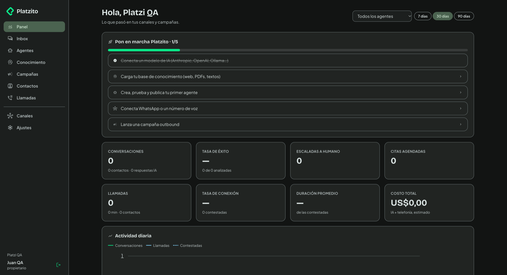
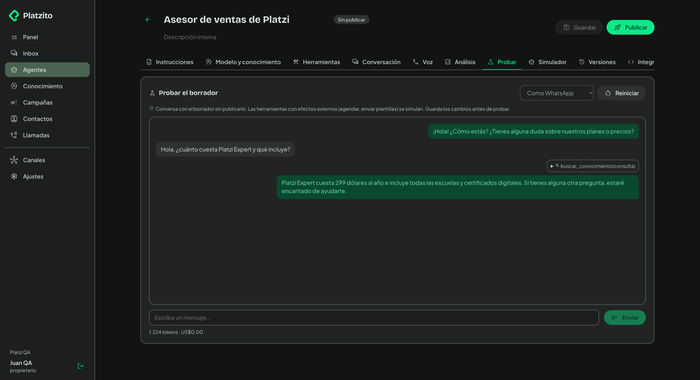
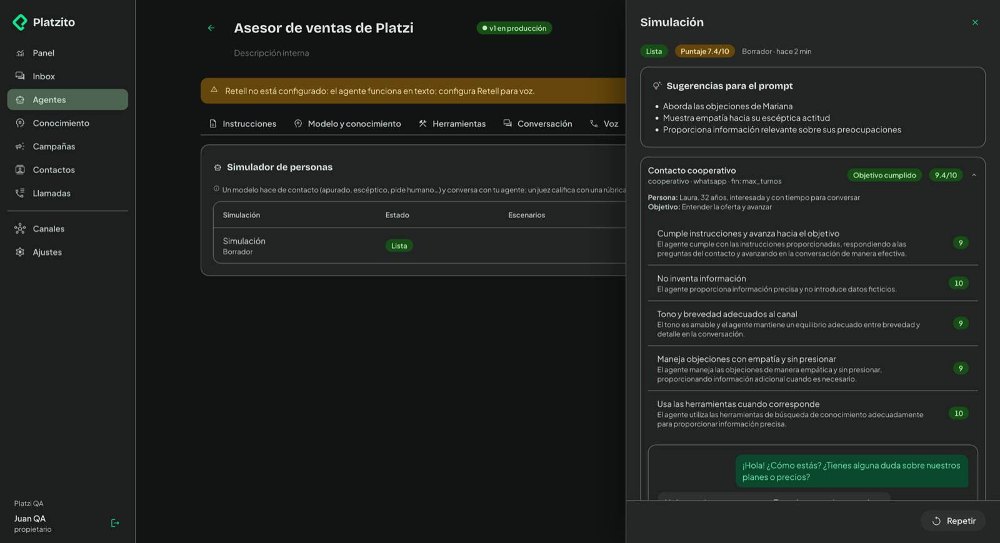
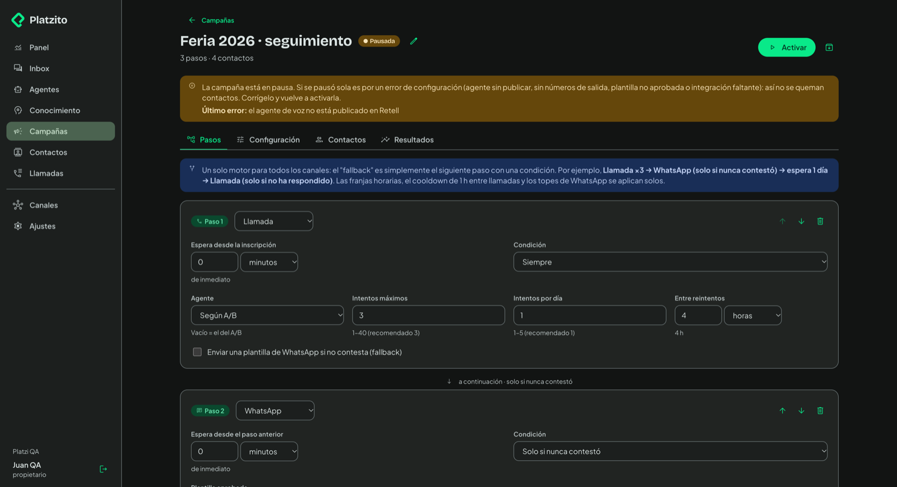
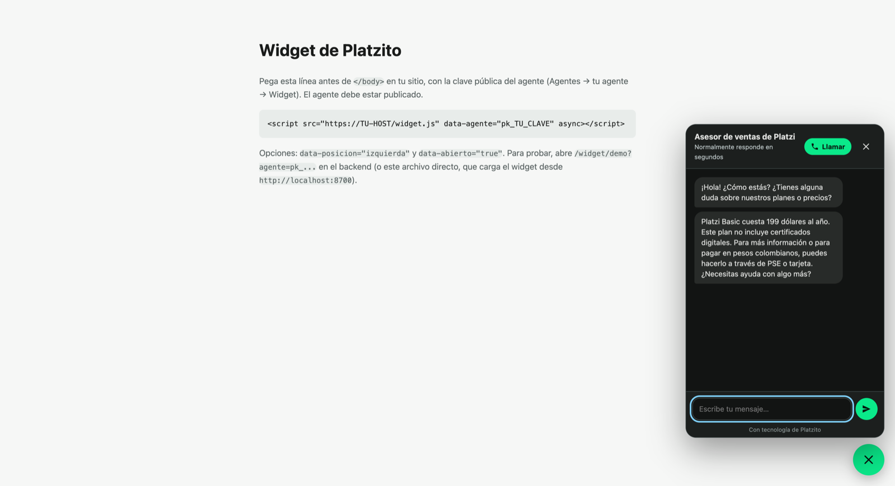

# Platzito

Agentes conversacionales omnicanal (**WhatsApp, voz y chat web**) y **campañas outbound** multicanal, con un solo cerebro por agente. Es una réplica mejorada de [Dapta](https://dapta.ai), construida a partir de la ingeniería inversa pasiva documentada en [`docs/`](docs/).



## Qué hace

- **Agentes**: prompt, modelo (Anthropic, OpenAI, Groq, Gemini u Ollama), herramientas (conocimiento, agenda, plantillas de WhatsApp, transferir, colgar, escalar, guardar dato, API propia) y guardas deterministas. Tienen borrador, publicación versionada y rollback. Un **copiloto** redacta el agente a partir de una descripción.
- **Mismo cerebro en todos los canales**: WhatsApp (Meta Cloud API directo), voz (Retell con *Custom LLM* por WebSocket) y un widget web embebible con chat y llamada desde el navegador.
- **Conocimiento (cerebros)**: webs, sitemaps, PDF, DOCX, hojas de cálculo y texto. Se fragmentan y se indexan con embeddings **locales** (`nomic-embed-text` vía Ollama) o de OpenAI.
- **Playground y simulador**: pruebas el borrador conversando, o dejas que un modelo haga de contacto (escéptico, apurado, pide humano…) mientras un juez califica con una rúbrica, todo antes de gastar llamadas reales.
- **Campañas (secuencias)**: pasos de llamada, WhatsApp, correo y espera, con condiciones (`siempre`, `sin_respuesta`, `no_conecto`), franjas horarias por zona del contacto, reintentos, cooldown, concurrencia, rotación de caller ID, A/B de agentes y protección de líneas de WhatsApp (calentamiento, topes por tier, dedupe de 24 h y pausa por calidad). Ante un error de configuración la campaña **se pausa sola** y no quema contactos.
- **Inbox**: conversaciones de todos los canales. Puedes asignar a un compañero (la IA se pausa), responder, mandar plantillas, dejar notas y cerrar con análisis automático.
- **Integraciones**: API REST con claves por rol, **servidor MCP** (métricas, leads, conversaciones y campañas; las escrituras piden `confirmar: true`), webhooks salientes firmados con HMAC y reintentos, y Cal.com y HubSpot opcionales.
- **Equipo**: espacios de trabajo, invitaciones y RBAC (propietario › admin › editor › operador › lector).

| Playground con conocimiento | Simulador de personas |
|---|---|
|  |  |
| **Campaña pausada por configuración** | **Widget web** |
|  |  |

## Arquitectura

```
                 ┌──────────────── frontend (React 19 + Vite, tokens Sinapsis de Platzi) ───────────────┐
                 │  Panel · Inbox · Agentes · Conocimiento · Campañas · Contactos · Llamadas · Ajustes  │
                 └──────────────────────────────────────┬───────────────────────────────────────────────┘
                                                        │ /api (JWT o X-Api-Key)
WhatsApp (Meta) ─► POST /webhooks/whatsapp  ─┐          ▼
  firma X-Hub-Signature-256 por espacio      │   ┌──────────────────────── backend (FastAPI) ─────────────────────────┐
Retell ─────────► POST /webhooks/retell ─────┼──►│ cerebro/motor.py  bucle agéntico + guardas  ◄── cerebro/herramientas │
  firma x-retell-signature                   │   │ conocimiento/     fragmentos + embeddings (Ollama / OpenAI)        │
Retell ═══WS════► /voz/llm/{agente}/{firma}/{call}  secuencias/   motor de campañas (tick idempotente)          │
Widget (widget.js) ► /widget/{clave_publica}/…   │ planificador.py   tick cada 30 s con lock en BD (o cron externo)   │
Clientes MCP ───► POST /mcp                      │ eventos.py        eventos → webhooks salientes firmados            │
                                                 └──────────────────────────┬─────────────────────────────────────────┘
                                                                            ▼
                                                              Postgres (prod) / SQLite (dev)
```

- **Un solo proceso** sirve la API, los webhooks, el WebSocket de voz, el widget y el frontend compilado (mismo origen).
- **Voz**: Retell pone STT, TTS, turnos y telefonía; en cada turno nos manda el transcript por WebSocket y respondemos en streaming con el mismo cerebro que en texto. La URL del WS lleva una firma HMAC por agente.
- **Aislamiento por espacio**: todo recurso (cerebros, plantillas, líneas, números, agentes, contactos) se valida contra el espacio en la API, en las herramientas del agente y en el motor de campañas.

Código: `backend/app/` (Python 3.12, en español), `frontend/src/` (TypeScript), `widget/` (JS sin dependencias más el SDK de Retell empaquetado).

## Cómo correrlo

### Desarrollo (`run.sh`)

```bash
./run.sh            # crea backend/.env y el venv si faltan; API en :8700 y frontend en :5173
```

Sin `ANTHROPIC_API_KEY` puedes usar un modelo local:

```bash
ollama pull qwen2.5:7b && ollama pull nomic-embed-text
LLM_PROVEEDOR=ollama LLM_MODELO=qwen2.5:7b ./run.sh
```

Abre http://localhost:5173/registro. El widget de prueba está en `http://localhost:8700/widget/demo?agente=pk_…` (la clave pública está en Agente → Integrar).

### Producción (`docker compose`)

```bash
cp backend/.env.example backend/.env   # ENTORNO=produccion, CLAVE_SECRETA, URL_PUBLICA, llaves…
POSTGRES_PASSWORD=… docker compose up -d --build
docker compose exec ollama ollama pull nomic-embed-text
```

La imagen compila el frontend y sirve todo en `:8700`. El planificador corre dentro del proceso; si escalas a varias réplicas, déjalo en una sola (`PLANIFICADOR_ACTIVO=false` en las demás) o llama `POST /interno/tick` con `X-Secreto-Tick` desde un cron.

### Pruebas

```bash
cd backend && .venv/bin/python -m pytest -q -p no:warnings          # SQLite temporal
PRUEBAS_DATABASE_URL=postgresql://$(whoami)@localhost/platzito_test \
  .venv/bin/python -m pytest -q -p no:warnings                      # contra Postgres
cd frontend && npx tsc -b --noEmit && npx vite build
```

Ninguna prueba sale a internet: `respx` simula Retell y Meta, y cualquier petición no simulada falla. El LLM y los embeddings son falsos y deterministas **solo** en pruebas.

Si actualizas `retell-client-js-sdk`, regenera el SDK del widget con `cd frontend && npm run sdk-widget`.

## Variables de entorno

Todas están en [`backend/.env.example`](backend/.env.example). Cada espacio puede sobrescribir las llaves de proveedores desde **Ajustes → Integraciones** (se guardan cifradas con Fernet).

| Variable | Para qué | Por defecto |
|---|---|---|
| `ENTORNO` | `produccion` activa firmas obligatorias y la protección SSRF | `desarrollo` |
| `URL_PUBLICA` | URL **estable** a la que llaman Meta y Retell (webhooks y WS de voz) | `http://localhost:8700` |
| `DATABASE_URL` | Postgres en producción; SQLite en desarrollo | `sqlite:///datos/platzito.db` |
| `CLAVE_SECRETA` | Firma JWT y la URL del WS de voz. **Cámbiala** | — |
| `CLAVE_CIFRADO` | Clave Fernet para secretos en reposo (si falta se deriva de `CLAVE_SECRETA`) | — |
| `SECRETO_TICK` | Habilita `POST /interno/tick` para un cron externo | — |
| `PLANIFICADOR_ACTIVO`, `PLANIFICADOR_INTERVALO_S` | Tick interno de campañas | `true`, `30` |
| `LLM_PROVEEDOR`, `LLM_MODELO` | Modelo por defecto de la instancia | `anthropic`, `claude-sonnet-5-5` |
| `ANTHROPIC_API_KEY`, `OPENAI_API_KEY`, `GROQ_API_KEY`, `GEMINI_API_KEY` | Llaves de la instancia | — |
| `OLLAMA_URL` | Ollama de la instancia (de confianza; la de un espacio se valida contra SSRF) | `http://localhost:11434` |
| `EMBEDDINGS_PROVEEDOR`, `EMBEDDINGS_MODELO` | Embeddings del conocimiento | `ollama`, `nomic-embed-text` |
| `RETELL_API_KEY` | Voz (también valida `x-retell-signature`) | — |
| `META_APP_ID`, `META_APP_SECRET`, `META_CONFIG_ID` | App de Meta (Embedded Signup y firma de webhooks) | — |
| `META_VERIFY_TOKEN`, `META_GRAPH_VERSION` | Verificación del webhook y versión de Graph | `platzito-verify`, `v23.0` |
| `SMTP_HOST`, `SMTP_PUERTO`, `SMTP_USUARIO`, `SMTP_CLAVE`, `SMTP_REMITENTE` | Pasos de correo en campañas | — |

## Platzito vs Dapta

| Capacidad | Dapta | Platzito |
|---|---|---|
| Motor de voz | Retell (migrando a LiveKit + SIP) | Retell con *Custom LLM* por WebSocket: el mismo cerebro que en texto |
| WhatsApp | Varios BSP | Meta Cloud API directo (Tech Provider + Embedded Signup), coexistencia con la app WhatsApp Business |
| Campañas | Dos "sequences" separadas (llamada y WhatsApp) | Un solo motor multicanal (llamada, WhatsApp, correo y espera) con fallbacks por condición |
| Protección de líneas | Reglas en la UI | Calentamiento, tope por tier y volumen reciente, dedupe de 24 h y pausa automática por calidad |
| Errores de configuración | — | La campaña se pausa sola y no quema contactos |
| Conocimiento | "Brains" (pipeline interno) | Cerebros con embeddings locales, búsqueda de prueba y umbral por agente |
| Pruebas antes de producción | Playground | Playground más **simulador de personas** con juez y rúbrica |
| Guardas | Dependen del modelo | Deterministas: escalar si piden humano, colgar al despedirse y no enviar nunca texto con herramientas escritas a mano |
| Webhooks | `x-api-key` fijas expuestas en el bundle público | Entrantes con firma HMAC por proveedor (y por espacio en Meta); salientes firmados con reintentos |
| Integración con agentes de IA | Servidor MCP público | Servidor MCP con claves por rol y escrituras con vista previa y `confirmar` |
| Multi-tenant | Workspaces | Espacios con RBAC de 5 roles; aislamiento validado en API, herramientas y motor de campañas |
| Despliegue | SaaS | Autohospedable: una imagen Docker más Postgres (Ollama opcional) |

## Qué requiere credenciales reales

| Pieza | Qué hace falta |
|---|---|
| LLM de calidad | `ANTHROPIC_API_KEY` (o equivalente con herramientas nativas). Los modelos locales sirven para desarrollo, pero son lentos para voz (1,4 a 6 s por turno) y siguen peor las herramientas. |
| Voz | Cuenta de **Retell** (`RETELL_API_KEY`), una troncal SIP o un número importado a Retell, y una `URL_PUBLICA` estable con TLS para el webhook y el WS. |
| WhatsApp | **App de Meta como Tech Provider**: Business Verification y App Review de `whatsapp_business_management` y `whatsapp_business_messaging`, configuración de Embedded Signup (`META_CONFIG_ID`), `META_APP_SECRET`, y el webhook suscrito a `messages`, `smb_message_echoes`, `message_template_status_update` y `phone_number_quality_update`. |
| Correo | Servidor **SMTP** con un remitente verificado (SPF/DKIM). |
| Agenda y CRM | API key de Cal.com y token de HubSpot (opcionales, por espacio). |
| URL pública | Dominio estable. Con un túnel temporal, al cambiar la URL hay que volver a publicar los agentes para que Retell reciba la nueva URL del WS. |

## Qué falta validar con cuentas reales

- **`create-web-call` de Retell**: en la validación con el SDK v3 hubo que pasar `transport="gateway"` e `ice_servers`. El backend hoy manda solo `agent_id`, variables y metadata (`app/canales/retell.py`). Hay que confirmar con una cuenta real si la llamada web del widget y del editor conecta sin esos campos.
- **Payloads reales de Retell**: `call_analyzed` (`call_analysis`), costos (`call_cost.combined_cost` en centavos) y latencias. Se implementaron según la documentación, sin haberlos observado.
- **Payloads reales de Meta**: ecos de coexistencia (`smb_message_echoes`), `phone_number_quality_update` (se empareja por `display_phone_number`) y `message_template_status_update`. También la firma con el app secret propio de un espacio.
- **Audio en el navegador**: no se pudo verificar en Chrome automatizado porque el permiso de micrófono queda en `prompt`.
- **Topes de WhatsApp en producción**: los tiers y la pausa por calidad se probaron con datos simulados.
- **Costos reales**: créditos de Retell y Meta por conversación frente a lo que estima el panel.

## Análisis de Dapta (ingeniería inversa)

Se usó ingeniería inversa **pasiva**: bundles JS públicos de `app.dapta.ai`, DNS, tráfico sin sesión y documentación pública. No se usaron credenciales de Dapta.

**Hallazgo central:** Dapta no construyó el motor de voz, sino que orquesta Retell. Su valor está en la capa de producto: WhatsApp multiproveedor, campañas con fallback cruzado, conocimiento por workspace, análisis post-llamada y la UI. Todo eso es replicable, y es lo que hace Platzito.

| # | Proceso | Doc | Confianza |
|---|---------|-----|-----------|
| 1 | Stack y topología | [01](docs/01-stack-y-topologia.md) | Alta |
| 2 | Agentes de texto y WhatsApp | [02](docs/02-texto-y-whatsapp.md) | Alta |
| 3 | Voz y telefonía | [03](docs/03-voz-y-telefonia.md) | Alta |
| 4 | Campañas outbound | [04](docs/04-campanas-outbound.md) | Media-alta |
| 5 | Conocimiento, post-call e integraciones | [05](docs/05-conocimiento-y-analisis.md) | Media / media-alta |
| 6 | Plan de réplica y validación empírica | [06](docs/06-plan-de-replica.md) | — |

**Antipatrón que se evitó:** el bundle público de Dapta expone `x-api-key` fijas de sus webhooks, así que cualquiera puede invocar esos flujos. En Platzito todos los webhooks llevan firma HMAC por proveedor y los secretos viven solo del lado del servidor.
